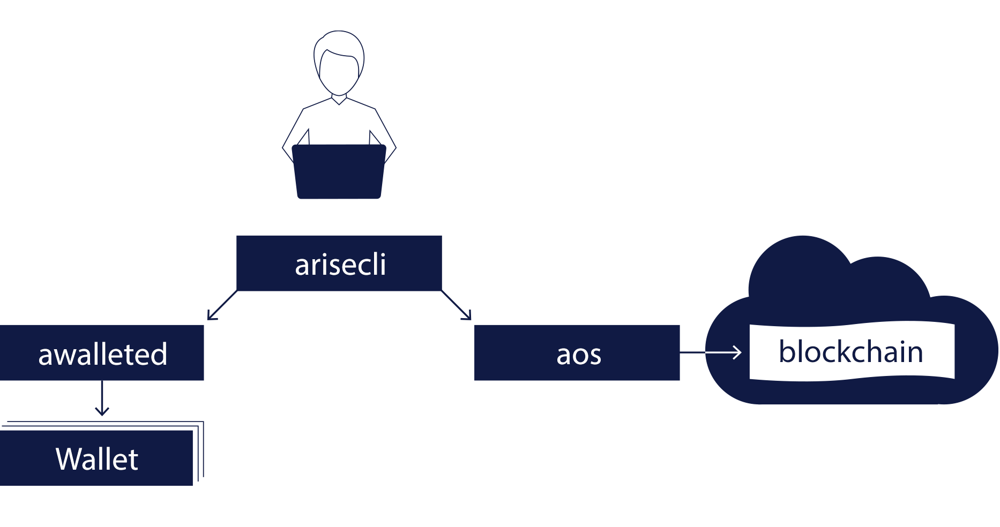

ARISEN is the next-generation blockchain platform for creating and deploying smart contracts and distributed applications. ARISEN comes with a number of programs. The primary ones included in ARISEN are the following:

* [Aos](01_aos/index.md) (a + os = aos)  - core service daemon that runs a node for block production, API endpoints, or local development.
* [Arisecli](02_arisecli/index.md) (arise + cli = arisecli) - command line interface to interact with the blockchain (via `aos`) and manage wallets (via `awalletd`).
* [Awalletd](03_awalletd/index.md) (awallet + d = awalletd) - component that manages ARISEN keys in wallets and provides a secure enclave for digital signing.

The basic relationship between these components is illustrated in the diagram below.

[[info | What's Next?]]
| [Install the ARISEN Software](00_install/index.md) before exploring the sections above.
